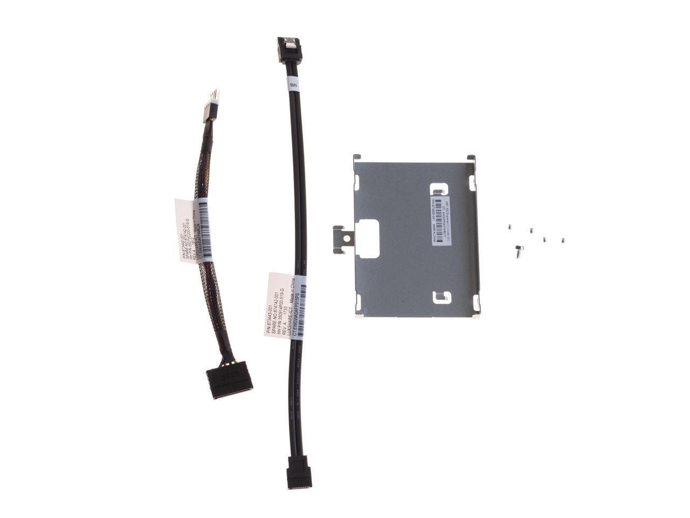

# Setting up Ubuntu Server on HPE ProLiant MicroServer Gen10

_Disclaimer: do this at your own risk. No fancy web gui here, just raw unix power._

[](./img/microservergen10.jpeg)

---

## Original [project](https://github.com/aamkye/ubuntu_on_WD_PRx100)..

.. was about setting up Ubuntu Server on WD PR4100. Some time passed, so LET'S upgrade!

## Overview

This tutorial covers how to install Ubuntu Server on HPE ProLiant MicroServer Gen10.

It goes from preparation, downloading required packages, running installation, initial configuration and extras that most likely are intended to be used.

---

## Ansible (automated way)

There is ansible automatization of most steps and more.

---

## HPE ProLiant MicroServer Gen10 Spec

```
* Release date: 2016
* CPU: AMD Opteron™ X3216 Processor (1.6-3.0GHz/2 compute cores/4 graphic cores/1MB/12-15W)
* RAM: 8GB (1 x 8GB) PC4-2400T DDR4 UDIMM / 32GB (2 x 16GB) PC4-2400T DDR4 UDIMM
* USB: 4 x 3.0 ports + 2 x 2.0 ports
* Bays: 4 x 3.5" SATA III (over RAID controller) + Internal SATA III port
  Maximum Internal Storage Non-hot plug SATA 16TB (4 x 4TB)
* LAN: 2 x 1 Gbit/s Ethernet
```

## Suggested addon:

HPE 870212-B21 - SSD converter kit:

[](./img/hpe-870212-B21.jpg)

* https://buy.hpe.com/us/en/options/cables-cable-kits/server-enablement-kits/server-enablement-kits/hpe-enablement-kits/hpe-microserver-gen10-sff-nhp-sata-converter-kit/p/870213-B21

---

## Links:

* https://www.hpe.com/psnow/doc/a00008701enw
* TBD

---

## Requirements

* USB flash drive (8GB+)
* Ansible

---

## Main process

Please follow [readme/ansible.md](readme/ansible.md) readme.
